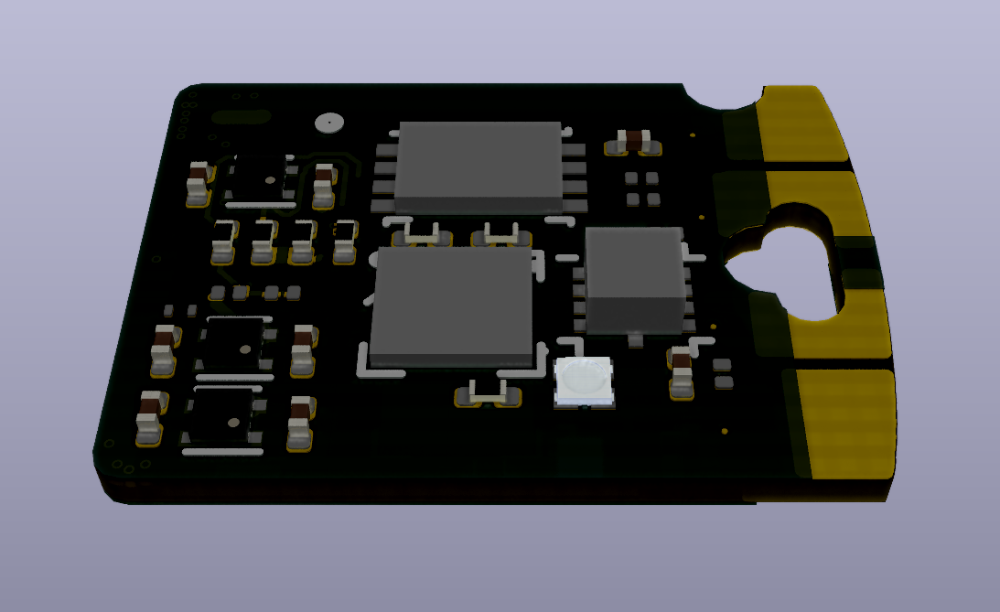

Quicklogic Qomu board
=====================

This repository contains PCB design files for Qomu FPGA board.

Key features
------------

* PCB size fitting in USB connector 
* USB connector on pads
* EOS S3 FPGA
* 16Mb Flash memory
* IMU
* CapTouch on pads
* supplied from USB 5V0 

