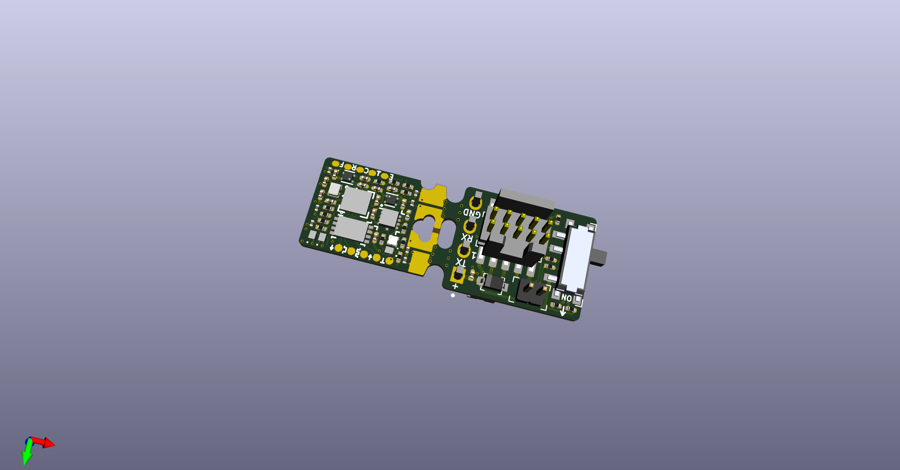

Qomu Development Board
======================

This repository contains PCB design files for a development board based on a Quicklogic EOS S3 Sensor Processing Platform

Key features
------------

* PCB size fitting in USB socket (13x9.5mm)
* EOS S3 Sensor Processing Platform
* 16Mbit of external flash memory
* Accelerometer
* User RGB LED
* Optional capacitive touch pads
* Supplied from USB 5V0
* USB contact pads
