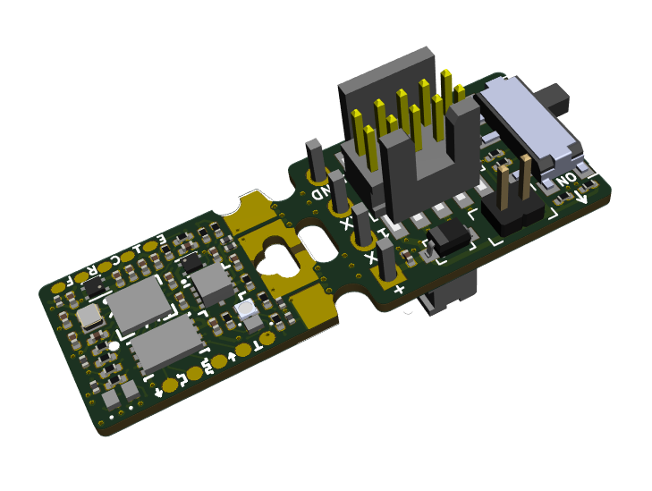

======================
Qomu Development Board
======================

Overview
========

This repository contains open hardware design files for a development board based on the Quicklogic `EOS S3 Sensor Processing Platform <https://www.quicklogic.com/products/eos-s3/>`_.
The design files were created by `Antmicro <https://www.antmicro.com>`_ in cooperation with `Quicklogic <https://www.quicklogic.com/>`_.
The board has a tiny outline which makes it fit into USB socket.
This allows to explore chosen functionalities of the EOS S3 platform on the go without extra space needed on your desk.

Key features
============

* EOS S3 Sensor Processing Platform
* 16Mbit of external flash memory
* Accelerometer
* User RGB LED
* Capacitive touch pads
* Supplied with 5.0VDC from USB port
* USB data signals tied to programmable logic

